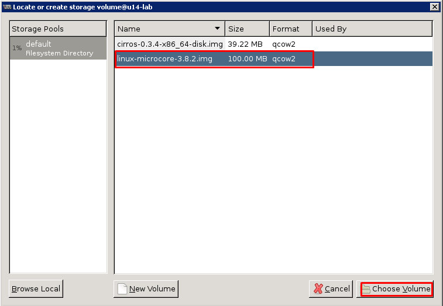

# Hướng dẫn cài đặt và quản lý KVM 

## Hướng dẫn cài đặt KVM 

### Mô hình
- Sử dụng vmware workstation làm môi trường dựng lab. 
- Máy server: 
 - Ubuntu 14.04 64 bit, 2 NIC (eth0 để ra internet tải gói - sử dụng `Bridge` hoặc `NAT`, eth1 quản trị - `hostonly`).
 - Máy server cài các gói KVM, gói virt-manager để điều khiển máy ảo thông qua giao diện đồ họa (`Virtual Machine Manager`)
 - Cài đặt Linux Bridge hoặc OpenvSwitch để ảo hóa network cho các máy ảo. Trong ví dụ này sử dụng Linux Bridge
 - Cài đặt các gói hỗ trợ X11 phía Server là: `xorg, openbox`
- Máy Client: 
 - Sử dụng hệ điều hành windows 
 - Cài đặt putty hoặc MobaXterm (ví dụ này dùng putty)
 - Máy này sẽ thực hiện điều khiển KVM thông qua giao diện đồ họa đã được cài trên phía máy chủ.


#### Cài đặt KVM với OpenvSwich
- Chú ý: 
 - Tham khảo 1: [Cài đặt KVM- OpenvSwitch trên Ubuntu 14.04](https://github.com/hocchudong/KVM-QEMU/blob/master/tailieu/catdat-kvm-openvswitch-ubuntu14.04.md)
 - Tham khảo 2: [Cài đặt KVM- OpenvSwitch trên Ubuntu 16.04](https://github.com/hocchudong/KVM-QEMU/blob/master/tailieu/catdat-kvm-openvswitch-ubuntu16.04.md)

#### Cài đặt KVM với Linux Bridge
- Nội dung:
 - Cài đặt KVM và Linux Bridge cùng các gói bổ trợ trên máy chủ
 - Cài đặt XMING trên Client, XMING là công cụ cho phép quản lý KVM thông qua X11, XMING được cài trên windows và kết hợp cùng với các ứng dụng ssh (putty, MobaXterm ...)

##### Phía server 
- Thực hiện cài đặt bằng tay hoặc bằng script (ví dụ này cài bằng script)
- Login vào máy chủ Ubuntu và thực hiện script với quyền root.
	```sh
	su -
	apt-get update
	wget https://raw.githubusercontent.com/hocchudong/KVM-QEMU/master/chuontrinh/setup-kvm.sh
	```

- Tùy chọn: có thể sửa dòng 28 trong file ` /etc/ssh/sshd_config` để cho phép ssh bằng tài khoản `root` từ xa, dòng đó sửa thành dòng dưới
	```sh
	PermitRootLogin yes
	```

- Thực thi script
	```sh
	chmod +x setup-kvm.sh
	bash setup-kvm.sh
	```

- Ở scrit trên sẽ cài đặt các thành phần sau
 - Thành phần KVM để tạo và quản lý máy ảo
 - Thành phần đồ họa quản lý KVM 
 - Gói linux bridge để cung cấp cơ chế network ảo cho máy ảo.
 - Gói hỗ trợ X11 phía server (script sử dụng gói xorg và openbox là các gói nhỏ nhẹ và hỗ trợ GUI cho linux)

#### Phía client 

- Ví dụ này sử dụng putty để ssh tới máy chủ Ubuntu
- Nếu bạn dùng các ứng dụng hỗ trợ thao tác enable X11 sẵn thì không cần làm bước này và chỉ cần bước SSH

Bước 1: 
- Tải Xming tại địa chỉ sau https://sourceforge.net/projects/xming/
- Cài đặt Xming, trong quá trình cài để mặc định các tùy chọn.
- Khởi động xming sau khi cài

Bước 2: 
- Cấu hình putty để sử dụng được xming
- Khởi động putty và cấu hình để kích hoạt X11 phía client theo hình các thao tác: `Connection` => `SSH` => `X11` 


Bước 3: 
- Thực hiện nhập IP của máy chủ Ubuntu vào mục `Secssion` trong putty


- Login với tài khoản `root` (lưu ý, tính năng cho phép ssh bằng `root` phải được kích hoạt trước) và gõ lệnh dưới để khởi động công cụ quản lý KVM
	```sh
	virt-manager
	```

- Sẽ có màn hình thông báo của Xming được hiển thị ra, bắt đầu có thể sử dụng công cụ `virt-manager` để quản lý KVM


- Chuyển xuống bước hướng dẫn tạo máy ảo trong KVM bằng GUI

## Hướng dẫn tạo máy ảo trong KVM bằng lệnh
```sh
Đang cập nhật
```

## Hướng dẫn tạo máy ảo trong KVM bằng công cụ đồ họa `Virtual Machine Manager`
### Tạo máy ảo từ đầu

- Máy ảo sẽ được tạo từ file ISO
	```sh
	update sau
	```

### Tạo máy ảo từ file images có sẵn (giống như file ghost)
- Yêu cầu cần cài đặt KVM, Linux Bridge hoặc OpenvSwitch và các gói hỗ trợ đồ họa. Bước này có thể tham khảo các tài liệu khác.
- Có thể thực hiện script hoặc tham khảo cách cài KVM, các thành phần hỗ trợ khác để thực hiện được các bước ở dưới theo tài liệu này: [Link](https://github.com/hocchudong/KVM-QEMU/blob/master/tailieu/ghichep-kvm.md#hướng-dẫn-sử-dụng-kvm-bằng-xming). 

#### Bước 1: Tải các file images và khởi động `Virtual Machine Manager`

Bước 1.1: Tải file img từ internet về
- Login vào máy chủ Ubuntu cài đặt KVM và chuyển sang quyền `root`
	```sh
	su -
	```

Bước 1.2: Di chuyển vào thư mục chứa các image của KVM trên máy chủ và tải các file images về
	```sh

	cd /var/lib/libvirt/images/

	wget https://ncu.dl.sourceforge.net/project/gns-3/Qemu%20Appliances/linux-microcore-3.8.2.img

	wget http://download.cirros-cloud.net/0.3.4/cirros-0.3.4-x86_64-disk.img
	```

- Hai file images trên sẽ được dùng để tạo máy ảo mà không cần phải cài từ đầu (chúng giống như những file ghost)

Bước 1.3: Kích hoạt Xming (X11 client) để điều khiển virt-magager
-  Lưu ý: trước khi thực hiện lệnh `virt-manage` cần tham khảo bài ở đây để biết cách setup X11 phía Client: [Link tham khảo](https://github.com/hocchudong/KVM-QEMU/blob/master/tailieu/ghichep-kvm.md#hướng-dẫn-sử-dụng-kvm-bằng-xming)
	```sh
	virt-manager
	```

- Sau khi thực hiện lệnh này xong sẽ có cửa sổ quản lý KVM xuất hiện.


#### Bước 2: Sử dụng GUI của virt-manage

Bước 2.1: Bắt đâu tạo máy ảo.
- Tại cửa sổ của `Virtual Machine Manager`, chọn `New`


- Nhập tên máy ảo
- Chọn file images đã download trước đó (bước này chính là bước tạo máy ảo từ file images có sẵn)

- Chọn `Forward` để sang bước tiếp

- Chọn `Browse` để tìm đến file images có sẵn


- Lựa chọn image `linux-microcore-3.8.2.img` và chọn `Choose Volume`



- Sau khi chọn xong, sẽ có màn hình dưới. Các mục khác để nguyên và chọn tiếp `Forward`


- Cửa sổ tiếp sẽ thiết lập RAM và CPU cho máy ảo, để mặc định và chọn `Forward`


- Cửa sổ tiếp theo sẽ thiết lập các tùy chọn khác
 - Lựa chọn vào mục `Customize configuration before install`
 - Chọn vào `Advance Options` để quan sát card mạng cho máy ảo, trong hướng dẫn này sử dụng card `Bridge` là `br0`. Lúc này máy ảo sẽ nhận IP cùng với card mạng đã được bridge (xem thêm tài liệu về linux bridge)

- Chọn `Finish`


- Lựa chọn vào mục `Boot Options`
- Tích vào mục `Hard Disk` để thiết lập chế độ boot của máy ảo từ disk
- Lựa chọn `Apply` để chấp nhận các thiết lập.
- Sau đó chọn `Begin Installation` để bắt đầu khởi động máy ảo.


- Màn hình console của máy ảo sẽ xuất hiện và có thể đăng nhập được vào máy ảo


- Màn hình quản lý của VMM

