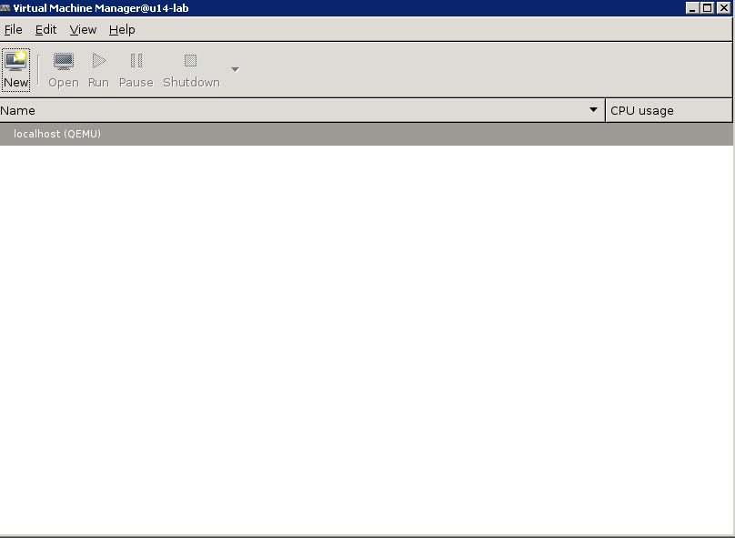
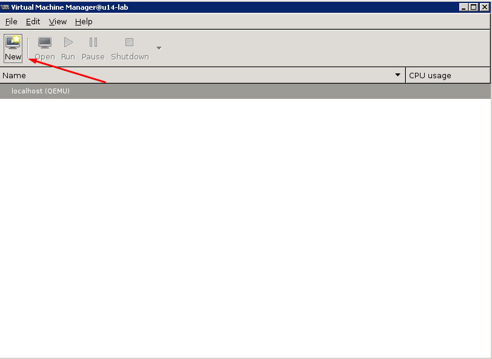
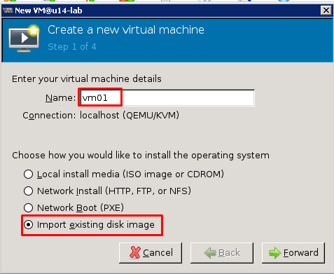
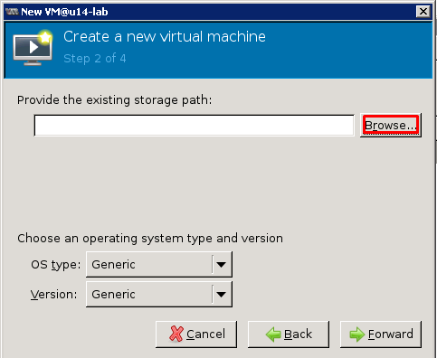
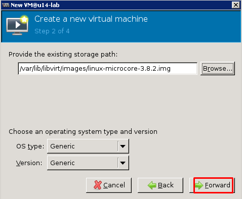
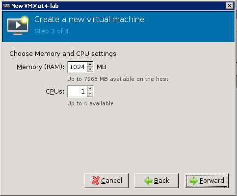
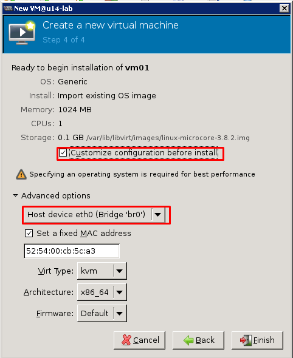
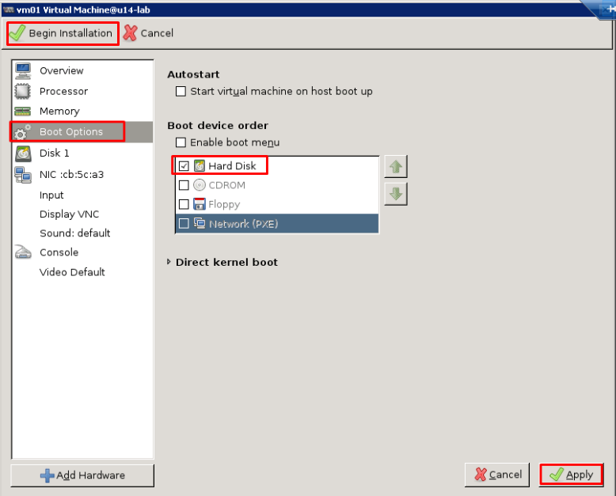
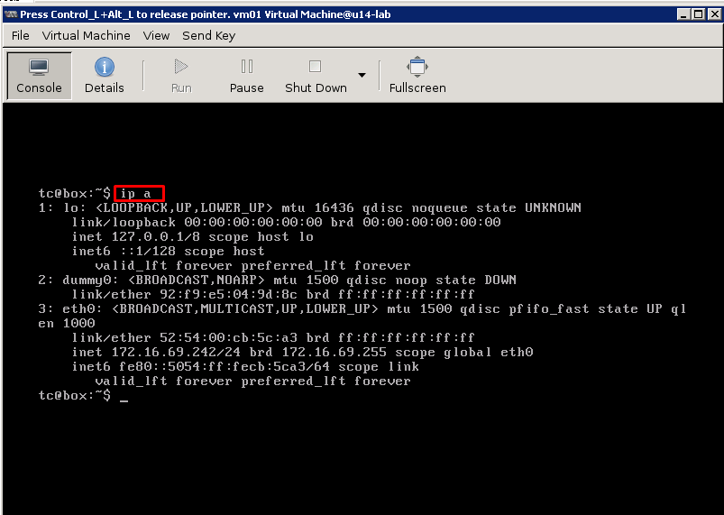

# Tài liệu hướng dẫn sử dụng KVM
- Yêu cầu: Đã cài đặt KVM và các công cụ hỗ trợ.

## Hướng dẫn tạo máy ảo trong KVM bằng lệnh
```sh
Đang cập nhật
```

## Hướng dẫn tạo máy ảo trong KVM bằng lệnh bằng công cụ đồ họa `Virtual Machine Manager`
### Tạo máy ảo từ đầu

- Máy ảo sẽ được tạo từ file ISO

```sh
update sau
```

### Tạo máy ảo từ file images có sẵn (giống như file ghost)
- Có thể thực hiện script hoặc tham khảo cách cài KVM, các thành phần hỗ trợ khác để thực hiện được các bước ở dưới theo tài liệu này: [Link](https://github.com/congto/KVM-QEMU/blob/master/docs/ghichep-kvm.md#hướng-dẫn-sử-dụng-kvm-bằng-xming)

#### Bước 1: Tải các file images và khởi động `Virtual Machine Manager`

Bước 1.1: Tải file img từ internet về
- Login vào máy chủ Ubuntu cài đặt KVM và chuyển sang quyền `root`
```sh
su -
```

Bước 1.2: Di chuyển vào thư mục chứa các image của KVM trên máy chủ và tải các file images về
	```sh

	cd /var/lib/libvirt/images/

	wget https://ncu.dl.sourceforge.net/project/gns-3/Qemu%20Appliances/linux-microcore-3.8.2.img

	wget http://download.cirros-cloud.net/0.3.4/cirros-0.3.4-x86_64-disk.img
	```

- Hai file images trên sẽ được dùng để tạo máy ảo mà không cần phải cài từ đầu (chúng giống như những file ghost)

Bước 1.3: Kích hoạt Xming (X11 client) để điều khiển virt-magager
-  Lưu ý: trước khi thực hiện lệnh `virt-manage` cần tham khảo bài ở đây để biết cách setup X11 phía Client: [Link tham khảo](https://github.com/congto/KVM-QEMU/blob/master/docs/ghichep-kvm.md#hướng-dẫn-sử-dụng-kvm-bằng-xming)
	```sh
	virt-manager
	```

- Sau khi thực hiện lệnh này xong sẽ có cửa sổ quản lý KVM xuất hiện.


#### Bước 2: Sử dụng GUI của virt-manage

Bước 2.1: Bắt đâu tạo máy ảo.
- Tại cửa sổ của `Virtual Machine Manager`, chọn `New`


- Nhập tên máy ảo
- Chọn file images đã download trước đó (bước này chính là bước tạo máy ảo từ file images có sẵn)

- Chọn `Forward` để sang bước tiếp

- Chọn `Browse` để tìm đến file images có sẵn


- Lựa chọn image `linux-microcore-3.8.2.img` và chọn `Choose Volume`

Sau khi chọn xong, sẽ có màn hình dưới. Các mục khác để nguyên và chọn tiếp `Forward`


- Cửa sổ tiếp sẽ thiết lập RAM và CPU cho máy ảo, để mặc định và chọn `Forward`


- Cửa sổ tiếp theo sẽ thiết lập các tùy chọn khác
 - Lựa chọn vào mục `Customize configuration before install`
 - Chọn vào `Advance Options` để quan sát card mạng cho máy ảo, trong hướng dẫn này sử dụng card `Bridge` là `br0`. Lúc này máy ảo sẽ nhận IP cùng với card mạng đã được bridge (xem thêm tài liệu về linux bridge)
- Chọn `Finish`


- Lựa chọn vào mục `Boot Options`
- Tích vào mục `Hard Disk` để thiết lập chế độ boot của máy ảo từ disk
- Lựa chọn `Apply` để chấp nhận các thiết lập.
- Sau đó chọn `Begin Installation` để bắt đầu khởi động máy ảo.


- Màn hình console của máy ảo sẽ xuất hiện và có thể đăng nhập được vào máy ảo



- Màn hình quản lý của VMM
